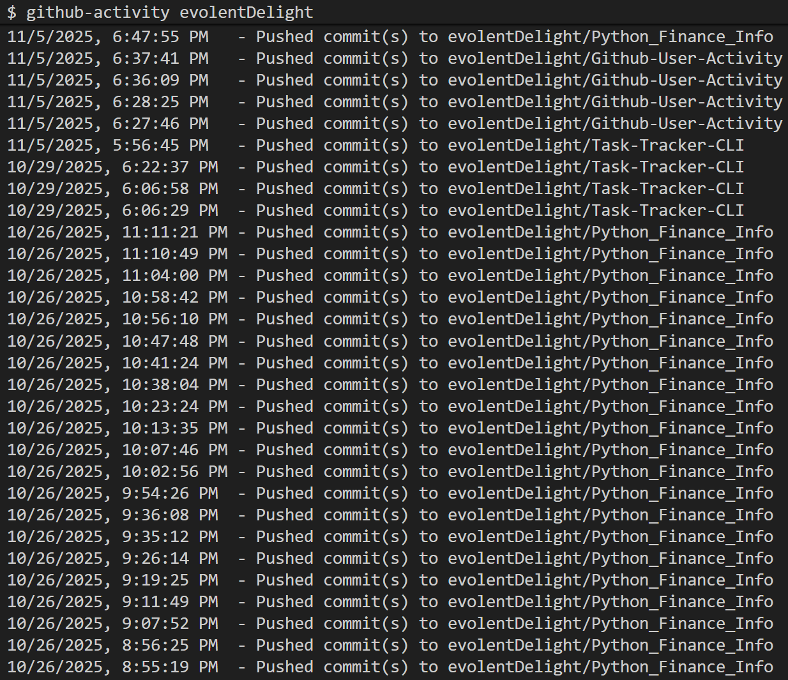

# Github-User-Activity

Roadmap Backend [Project URL](https://roadmap.sh/projects/github-user-activity)

## Function

Print out the user-inputted github account's public activity/events

# How To Use

## Download NodeJS

For this to work, you must have NodeJS installed.  
First, download NodeJS from their website and install it

## Download the Main Application Files and Link the Application

1. Download the main application files from this repository
2. And place them anywhere on your computer
   - If needed, unzip them first before placing them
3. Then, go into the folder/directory containing the files
4. Open up a console, terminal, or Command Line Interface in that very folder/directory
   - Git Bash
     - This can be downloaded on Git website
5. Type in `npm link` and Press Enter key

## Run the Application

Open up the console, terminal, or Command Line Interface in any folder/directory.

Using the keyword
`github-activity <github username>`

Sample Output:

## For Unlinking and Deleting the Application

1. Go into your folder/directory with the main application files(The files downloaded from this repository)
2. Open up a console, terminal, or Command Line Interface in that folder/directory with the main application files
3. Type in `npm unlink -g` and Press Enter key
4. The uninstallation is complete
5. The Main application files can now be deleted
